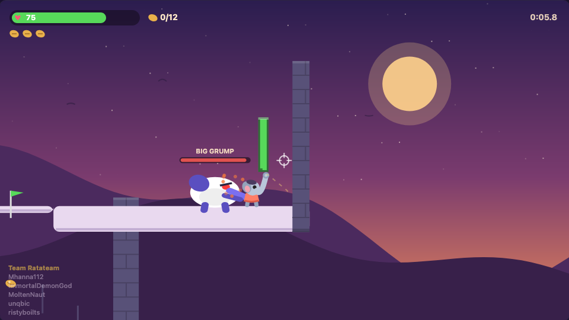
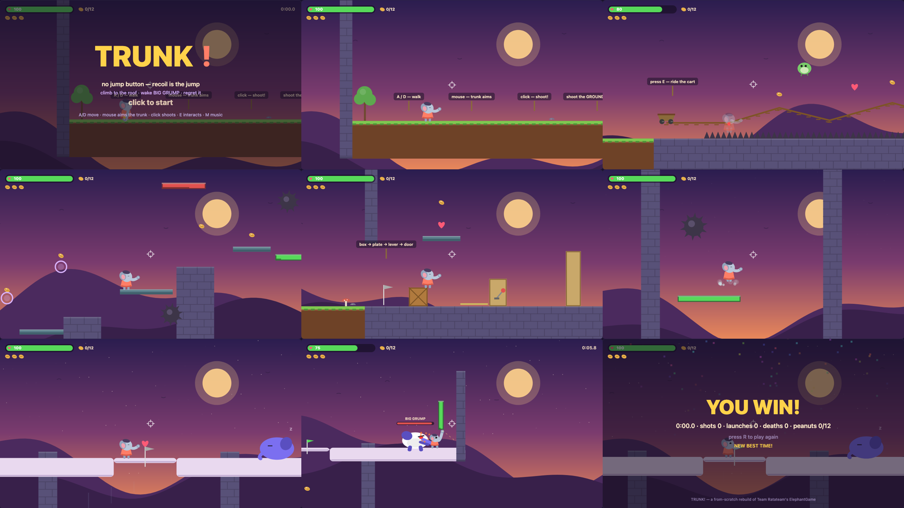

# TRUNK!

**▶ PLAY NOW: https://immortaldemongod.github.io/trunkgame/**



A ground-up TypeScript rebuild of Team Ratateam's game-jam project *ElephantGame*
(Unity). Not a port — a redesign built from the original's ideas ("the spirit"),
with its failure modes designed out. See `DESIGN.md` for the full redesign
rationale and the fun audit.

## How to run

**In your browser (nothing to install):**
https://immortaldemongod.github.io/trunkgame/

**Offline:** download `dist/index.html` and double-click it — one self-contained
~52KB file, no dependencies, no server.

**Dev way** (only needed to modify the game):
```bash
# install bun once: https://bun.sh  (curl -fsSL https://bun.sh/install | bash)
bun test          # run the 22 bot playtests
bun run build.ts  # rebuild dist/index.html
open dist/index.html
```
No node_modules, no package install — the game has zero dependencies; bun is
just the TypeScript runner/bundler.

**Note for ElephantGame teammates:** this branch (`trunkgame-ts-rebuild`) has
its own history, unrelated to the Unity project on `master`. Don't check it out
inside your Unity clone — Unity will not enjoy the working tree swap. Use a
separate clone/worktree, or just grab `dist/index.html`.

## The pitch

You are an elephant girl whose trunk is a multitool: gun, jump, key, and hands.
Bullets ricochet; every bounce near you launches you — there is no jump button,
**recoil is the jump**. 3 shots per flight; land, grab a ring, or bounce off
green to reload. Journey: tutorial ledge → gap field → minecart over spike
alley → tower ladder → box-and-lever puzzle room → pulsing wind shaft → rooftop
boss who dodges shots aimed at his face (bank shots off the mirrors).

## Structure

- `src/game.ts` — pure deterministic logic: no DOM, no `Date`, no
  `Math.random`. `step(state, input, dt)` is the whole game.
- `src/render.ts` — canvas renderer, pure function of state.
- `src/main.ts` — browser shell: input, fixed-step loop, procedural WebAudio
  SFX, trajectory preview, screenshot/demo query params.
- `test/bot.test.ts` — 16 bot playtests (`bun test`), including a waypoint bot
  that completes the whole game and a casual-player difficulty sim.
- `build.ts` — `bun run build.ts` bundles everything into `dist/index.html`.

## Verification

- 19/19 bot tests green; full-run bot finishes spawn→boss-kill with 0 deaths.
- 36,000-step random-input fuzz: no NaN, no leaks, no out-of-world.
- Casual-player sim (reaction lag + aim error): median 1 death on the gap field.
- Honest boss duel (no healing): bot-optimal kill ≈ 15s taking 10 damage;
  humans ≈ 2-3x.
- Every level beat screenshot-reviewed via Firefox headless
  (`?x=&y=`, `?demo=launch|boss|win` query params).

## Query params (testing hooks)

`?x=100&y=10` teleport spawn · `?checkpoint=3` spawn at checkpoint ·
`?demo=launch|boss|win` canned action states for screenshots.

## The whole journey


